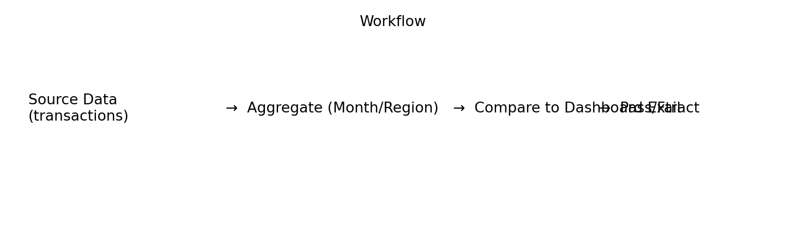
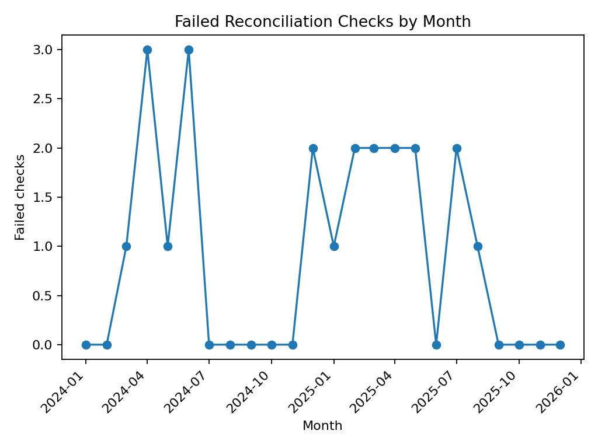
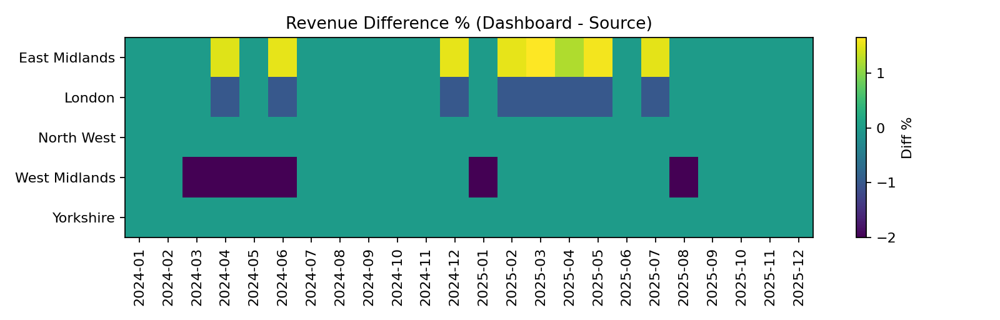

# Dashboard Refresh QA & Reconciliation (SQL + Python)

This project demonstrates a practical reporting skill: **validating dashboard numbers** after a refresh.

In many organisations, analysts must confirm that:
- totals in Power BI / dashboards match the source system
- joins/mappings haven’t introduced gaps
- ETL changes didn’t break KPI calculations

This repo includes synthetic source data and a “dashboard extract” with intentional discrepancies to show how reconciliation flags issues.

> ✅ Data in this repo is **synthetic** (safe to publish).

---

## Screenshots





---

## Business Question

How can we run a quick QA check after a dashboard refresh to confirm that:
- revenue totals match the source within tolerance
- order counts match the source within tolerance
…and automatically flag month/region combinations that need investigation?

---

## What I delivered

- Synthetic datasets:
  - `data/raw/source_transactions.csv` (source-of-truth transactions)
  - `data/raw/dashboard_extract.csv` (what the dashboard is showing)
- A reconciliation script that:
  - aggregates source by month/region
  - compares to dashboard extract
  - calculates diffs and % diffs
  - flags pass/fail using tolerances
- Outputs:
  - `outputs/reconciliation_report.csv`
  - `outputs/reconciliation_summary.csv`
  - `outputs/reconciliation_summary.md` (stakeholder-friendly)

---

## QA checks / tolerances

Default tolerances in the script:
- Revenue difference % tolerance: **±0.5%**
- Orders absolute tolerance: **±1 order**

(These are configurable.)

---

## How to run (local)

### 1) Install
```bash
pip install -r python/requirements.txt
```

### 2) Run reconciliation
```bash
python python/run_reconciliation.py
```

### 3) Review outputs
- Open `outputs/reconciliation_report.csv` in Excel
- Read `outputs/reconciliation_summary.md` for a quick overview of failures

---

## Repo structure

```text
06-dashboard-reconciliation-qa/
  data/
    raw/
      source_transactions.csv
      dashboard_extract.csv
      region_map.csv
  python/
    run_reconciliation.py
    requirements.txt
  sql/
    recon_queries.sql
  docs/
    qa_checklist.md
  outputs/
    reconciliation_report.csv
    reconciliation_summary.csv
    reconciliation_summary.md
  images/
    workflow.png
    failed_checks_by_month.png
    revenue_diff_heatmap.png
```

---

## Investigation checklist

A reusable checklist is in: `docs/qa_checklist.md`

Typical causes of mismatches:
- missing mappings (e.g., region/category)
- filters applied in the dashboard but not in source totals
- duplicate removal or deduping logic applied unexpectedly
- late-arriving data / partial refresh windows

---
